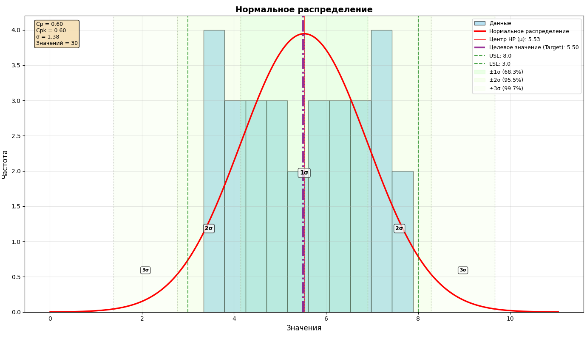

Counts CP/CPk and shows Probability Density Function (PDF) of Normal Distribution with Matplotlib

1. Unload template with left side button (to .xlsx).
2. Fill template by your values (USL, LSL and measurements) with Excel or other app.
3. Load template with right side button.
4. Check your graphs.

Available next parameters on graphs:
1. CP
2. CPk
3. σ
4. Probability Density Function (PDF) of Normal Distribution
5. Center of PDF
6. Target value of center
7. Zones of 1σ, 2σ, 3σ
8. USL/LSL

